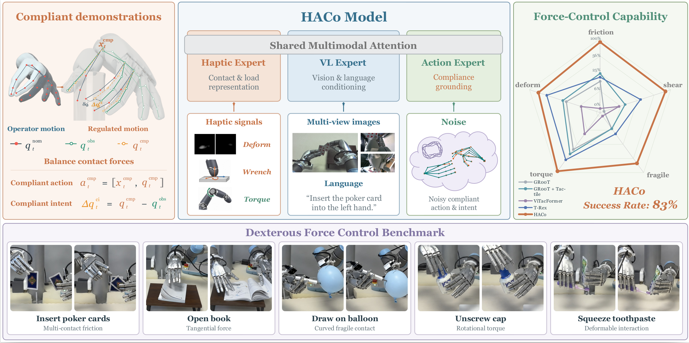

# HACO

HACO is a vision-language-action policy for contact-rich bimanual dexterous
manipulation. It conditions on three RGB views, robot state, joint torque,
tactile deformation, tactile wrench, and a language instruction.



## Setup

HACO requires Linux, Python 3.10, CUDA 12.8, Git LFS, and FFmpeg.

```bash
sudo apt-get update && sudo apt-get install -y git-lfs ffmpeg
git lfs install

git clone https://github.com/OpenDriveLab/HACo.git
cd HACo
git clone --recurse-submodules https://github.com/NVIDIA/Isaac-GR00T.git \
  third_party/Isaac-GR00T
git -C third_party/Isaac-GR00T checkout \
  4b1dca9d88d2a0b9ea5a65aa61c82ff89f5c4f0e
git -C third_party/Isaac-GR00T submodule update --init --recursive

curl -LsSf https://astral.sh/uv/install.sh | sh
cd third_party/Isaac-GR00T
uv sync --python 3.10
cd ../..
uv pip install --python third_party/Isaac-GR00T/.venv/bin/python -e '.[deployment]'
source third_party/Isaac-GR00T/.venv/bin/activate
```

Download the pretrained base model and vision-language backbone:

```bash
mkdir -p checkpoints
hf download nvidia/GR00T-N1.7-3B --local-dir checkpoints/base_model
hf download nvidia/Cosmos-Reason2-2B \
  --local-dir checkpoints/cosmos_reason2_2b
```

## Dataset

Training data uses the LeRobot v2 directory format at 30 Hz. A complete
two-second example is included in `dataset/sample`; validate it with:

```bash
python -m scripts.data.haco.validate_dataset dataset/sample
```

Record the following values for every frame:

| Data | Shape | Meaning |
| --- | ---: | --- |
| `observation.state` | `62` | current left/right wrist pose (18) and current hand state (44) |
| `action` | `150` | `wrist_obs` (18), `q_obs` (44), `q_cmp` (44), `delta_q` (44) |
| joint torque | `44` | measured hand-joint torque |
| tactile wrench | `10 x 6` | `[Fx, Fy, Fz, Tx, Ty, Tz]` for ten fingertips |
| tactile deformation | `10 x 240 x 240` | one uint8 deformation map per fingertip |
| RGB video | three streams | ego, left wrist, and right wrist cameras |
| language | one string per task | the instruction describing the demonstrated task |

The action at row `t` describes the next observation: `q_obs` is the measured
hand state at `t+1`, `q_cmp` is the compliant command learned by HACO, and

```text
delta_q = q_cmp - q_obs
```

The exact column slices, hand-joint order, fingertip order, video paths, sensor
sidecar fields, and metadata files are defined by
`dataset/sample/meta/info.json` and `dataset/sample/meta/modality.json`. Copy
that schema for each task dataset and replace the sample values and prompt.
Set `anchor_valid=true` only where eight earlier frames and 40 target frames
exist, then compute the train-split normalization files and validate everything:

```bash
python -m scripts.data.haco.prepare_dataset /path/to/your/lerobot_dataset
```

## Training

Configure the dataset and pretrained weights:

```bash
export HACO_DATASET_PATH=/path/to/your/lerobot_dataset
export HACO_BASE_MODEL_PATH="$PWD/checkpoints/base_model"
export HACO_VLM_MODEL_PATH="$PWD/checkpoints/cosmos_reason2_2b"
export CUDA_VISIBLE_DEVICES=0,1,2,3
```

Configure Weights & Biases:

```bash
wandb login
export WANDB_ENTITY=your-team
export WANDB_PROJECT=haco
export WANDB_MODE=online
```

Validate the complete launch configuration without starting training:

```bash
HACO_DRY_RUN=1 bash scripts/launch/haco/haco.sh
```

Start training:

```bash
bash scripts/launch/haco/haco.sh
```

The default configuration uses four GPUs, batch size 12 per GPU, and 30,000
steps. Checkpoints and W&B files are written to `logs/haco/`.

## Inference server

Start the WebSocket policy server from a trained checkpoint:

```bash
CUDA_VISIBLE_DEVICES=0 bash scripts/deploy/haco/launch.sh \
  /path/to/haco-checkpoint \
  "$PWD/checkpoints/cosmos_reason2_2b"
```

The server exposes health at `http://localhost:5500/healthz`, metadata at
`http://localhost:5500/metadata`, and binary MessagePack inference at
`ws://localhost:5500/infer`.

To check a checkpoint end to end, launch the server, send the included
`unscrew_cap` sample, request one 40-frame action chunk, and render the GT and
prediction videos:

```bash
python -m scripts.inference.haco.quick_test \
  --checkpoint /path/to/haco-checkpoint \
  --backbone "$PWD/checkpoints/cosmos_reason2_2b" \
  --reference-repo "$PWD/third_party/Isaac-GR00T"
```

The two videos are written to `outputs/quick_test/viz__gt_hand_motion.mp4` and
`outputs/quick_test/viz__pred_hand_motion.mp4`. Each frame shows the hand
skeletons on the left and tactile force/torque plus `delta_q` on the right.

## License

HACO is released under the [Apache License 2.0](LICENSE).
